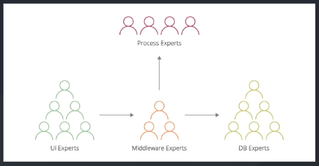
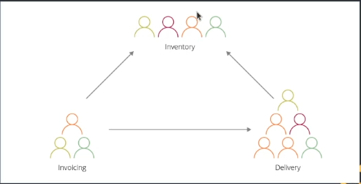
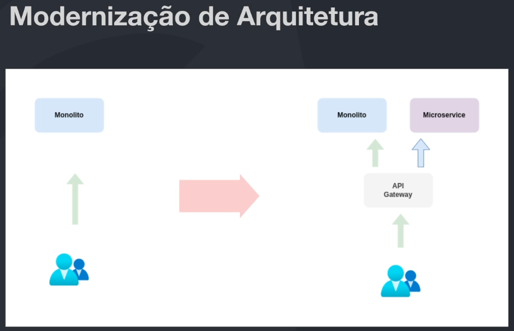
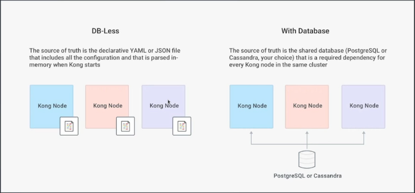
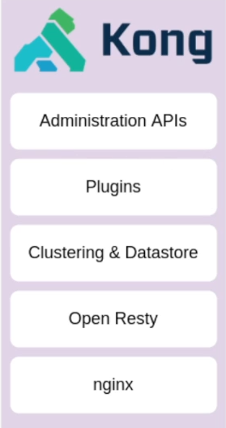
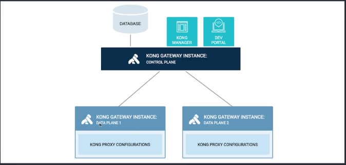

## API Gateway

## Rodando o docker-compose do kong

```
docker-compose -f compose/kong_compose.yml up -d
```

### Quais são as funcionalidades?
- Rate limiting
- Autenticação/Autorização de maneira padronizada
- Controle de Logs
- Gerenciamento de PIs (routing)
- Métricas padronizadas (ops team) 
    - Status coodes com maior frequência
- Tracing Distribuidos


## Tipos de gateway

### Enterprise Gateway
Foco deste tipo de solução é na frande maioria das vezes realizar exposição e gerenciamento de deployment de APIs voltadas ao negócio, em geral ele também permite controlar o ciclo de vida de uma API.<br />
Tenda a direcionar a apliação da solução e imlcar no design dos seus serviços (O que nem sempre é bom).
Pode ser utilizado para modernização de arquitetura aplicadndo padrões como façade ou Strangler Application (deve ser o meio e não o final). <br />
Disponibilidade vs Conssitência (dependências externas tipo banco, lambda, fila, etc).


#### Propósito principal
Exposição, composição e gerenciamento de PIS externas/internas

#### Manutenção das APIs
Time de APIs em geral faz administração via Portal do API Gateway

#### Suporte a ambientes
Suporta múltiplos ambientes DEV, QA e Prod


### Micro/Microservices Gateway
Tipicamente essa classe de Gateways m a capacidade de "rotear" tráfego de entrada para APIs ou serviços. <br />
Em geral não oferecem suporte ao ciclo de vida das APIs e as equipes tem que fazê-lo via processo separado (mais utilizado).


#### Propósito principal
Exposição, observabilidade e monitoramento de serviços (APIs)

#### Manutenção das APIs
Time de API ou time de criação/manutenção do serrviço via configuração declarativa fazem atualizações, esta rarefa faz parte do deployment dos serviços

#### Suporte a ambientes
A instância controla um único ambiente, possui suporte a roteamento mais dinâmico como por exemplo Canary para facilitar o debugging..


### Vantagens API Gateway

- Padronização de algmas features ortogonais (logging, segurança)
- Ajuda na governança de rede da companhia
- Ponto único de entrada na rede, facilita gerenciamento
    - Ponto único de entrada na rede
- Ferramento essencial para adoção de uma estratégia de APIs

### Desvantagens
- Adiciona alguma complexidade na sua arquitetura
- Precisa de um cuidado extra, devido a disponibilidade
- Ferramenta que precisa de manutenção/atualização
    - Evolução de ataques de hackers


## Como escolher um API Gateway

Considere o desenha das equipes da sua companhia na escolha

O desenho abaixo o ideal é o enterprise gateway.
Time não misto com disciplina única.<br />


Time mistro com múltiplas disciplinas

Abaixo o Microgateway é ideal.
Em geral as empresa usam o Micro gateway.<br />


### Modernização de Arquitetura
Você pode converter aos poucos a migração de um monolito usando os recursos do API gateway.



### Tipos de Deployment
Alguns plugins não são compatíveis com o DB less (oauth2 não funciona em DB-Less)


# Kong API Gateway  

- API Gateway Open Source
- Características Micro Gateway
    - Não tem controle de versão da API
    - Controle de API
    - Controle de quem pode mexer na API
    - Não gerencia o ciclo de vida da API
- Deployment flexível
- Pronto para kubernetes
- Extensível via plugins

## Arquitetura do Kong
Restty;: az reload de um servidor nginx e aceita script lua para o nginx em runtime.


## Subscriptions

## Modelos de deployment


### Deployment distribuído
O modelo distribuído acessa o banco de dados.


### Deployment Híbrido
É o modelo mais recomendado.
Data plane não tem acesso à banco de dados, somente o control plane.



## 