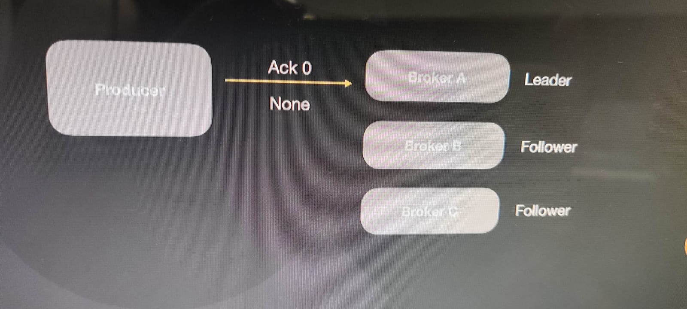
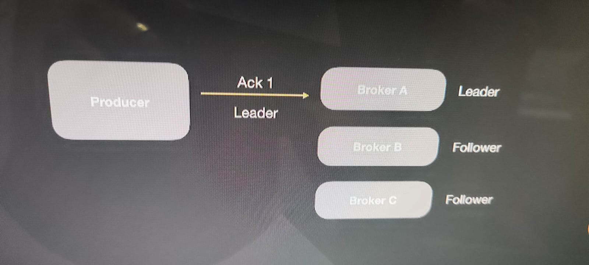
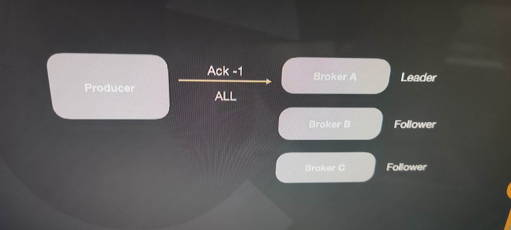
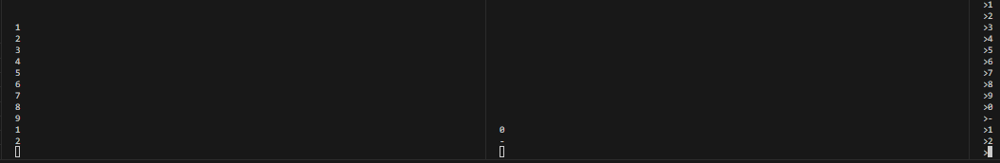
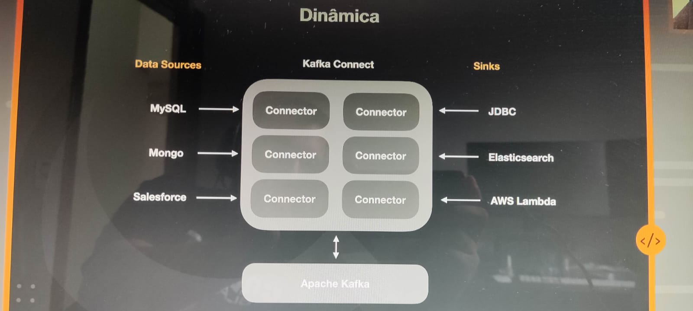
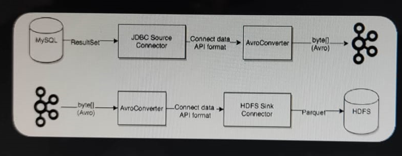

# Apache Kafka

O mundo dos eventos
Cada dia mais precisamos mais e mais eventos em diversos  tipos de plataforma. Desde sistemas que precisam se comunicar, devices para IOT, monitoramento de aplicações, sistemas de alarmes, etc.

Perguntas:
- Onde salvar esses eventos?
- Como recuperar de forma rápida e simples de forma que o feedback entre um processo e outro ou mesmo entre um sistema e ouro possa acontecer de forma fluida e em tempo real?
- Como escalar?
- Como ter resiliência e alta disponibilidade?

## Poderes
- Altíssimo throughput
- Latência extremamente baixa (2ms)
- Escalável
- Armazenamento
- Alta disponibilidade
- Se conecta com quase tudo
- Biblioecas prontas para as mais diversas tecnologias
- Muitas ferramentas open-source

## Empresas usando Kafka
- Linkedin
- Netflix
- Uber
- Twitter
- Dropbox
- Spotify
- Paypal
- Bancos...

## Anatomia de uma mensagem no Kafka

É possível subdividir as mensagens em partições, onde de 1M de mensagens 500Mil vai para a máquina 1 os outros 500 mil vai para a máquina 2, dobrando assim a velocidade, permitindo a informações estar distribuída.

## Garantindo ordem de entrega

A ordem de entrega podem ser feitas através das "Keys", já que para uma mesma chave a partição sempre será a mesma.

## Partições distribuídas
Replicator Factor = 2

Uma mensagem parao mesmo broker com 2 partições em cada pertição, isso garante resiliência.

## Partições Leadership

Cada partição tem o seu lider em diversos broker diferentes, e um broker cair, em outro broker com aquela partição toma a liderança.

## Garantia de entrega

Neste cenário não há garantias de entrega quando o producer insere uma mensagem, em alguns cenários isso é interessante já que ele consegue processar muito mais mensagens e muito mais rápido.


Neste cenário tem-se a confirmação que o broker leader recebeu a mensagem, mas se por acaso a maáquina queimou antes de replicar a mensagem, então a mensagem foi perdido, mas você tem a garantia que pelo menos o leader recebeu a mensagem, o que acaba perdendo um pouco de performance já que o producer precisa receber a garantia da entrega da mensagem.


Já neste cenário o producer só tem a garantia da entrega da mensagem em todos os brokers, após todos eles sinalizarem que receberam a mensagem, o que acaba deixando um pouco lento, porém garante a entrega da mensagem.


## Producer: Garantia de entrega

At most once: Melhor performance. Pode perder algumas mensagens
At least once: Performance moderada. Pode duplicar mensagens
Exactly once: Pior performance. Exatamente uma vez


## Producer indepotente

OFF: 
- Pode gravar a mensagem duplicada caso houver uma falha de rede e retry
- Consumer vai ler a mensagem 2x

ON:
- Descarta a mensagen duplicada

## Consumers

Não tem como no mesmo grupo o consumer ler a mesma partição.<br>
Se tiver mais consumer do que partição, então o consumer excedente vai ficar parado.<br>
O melhor do mundo é você ter o mesmo número de partições com o mesmo número de consumers.<br>
Sempre ter o número de partição maior ou igual ao número de consumers, para não ter consumers em idle.<br>
Se um consumer não estiver dentro do mesmo grupo, então ele vai ler todas as partições, ex: Consumer A e B estão no grupo X, se o consumer C não estiver no grupo X, então ele vai ler as mensagens de todas as partições.<br>
NÃO TEM COMO DOIS CONSUMERS LER MENSAGENS DA MESMA PARTIÇÃO.<br>


# Interagindo
```
docker exec -it 2conceitosbasicos-kafka-1 bash
```
## Criação e listagem de tópicos e partições
```
kafka-topics --create  --topic=teste --bootstrap-server=localhost:9092 --partitions=3
kafka-topics --list --bootstrap-server=localhost:9092
kafka-topics --bootstrap-server=localhost:9092 --topic=teste --describe
```

## Simulando consumer
### Em um bash
```
kafka-console-consumer --bootstrap-server=localhost:9092 --topic=teste
```
### Lendo desde o início (TUDo, inclusive o que já foi lido)
```
kafka-console-consumer --bootstrap-server=localhost:9092 --topic=teste --from-beginning
```

### Lendo Grupo
Desta forma, cada consumer vai ler uma partição do grupo.

```
kafka-console-consumer --bootstrap-server=localhost:9092 --topic=teste --group=x
```

### Como saber o que cada consumer está consumindo
Basta fazero describe do consumer
```
kafka-consumer-groups --bootstrap-server=localhost:9092 --group=x --describe
```

## Simulando producer
### Em outro Bash
```
kafka-console-producer --bootstrap-server=localhost:9092 --topic=teste
>Testando
```

## Kafka Connect

### Kafka Connect NÃO é
- ferramente de ELT
- Integração de dados mirabolantes
- Apacha Nify

### Kafka Connect é

Composto por worker com diversos connectores para fazer tarefas

### Distributed Workers
kafka Connect Cluster

### Converters

As task utilizam os convertes para mudar o formato dos dados tanto para leitura ou escrita no Kafka.
- Avro (trabalha com dados em JSON)
- Protobuf (dados binparios)
- JsonSchema (Analisa com base no schema register, valida o json)
- String
- ByteArray



### DLQ - Dead Letter Queue

Quando já um registro inválido, independe da razão, o erro pode ser tratado nas configurações do connector através da propriedade "errors.tolerance". Esse tipo de confguração pode ser realizado papenas para conectores do tipo "Sink".

- none: Faz a tarefa falhar imediatamente
- all: Erros são ignorados e o processo continua normalmente
- errors.deadletterqueue.topicname: <nome-do-topico>: Sempre que der um erro, ele vai jogar a mensagem em um tópico
