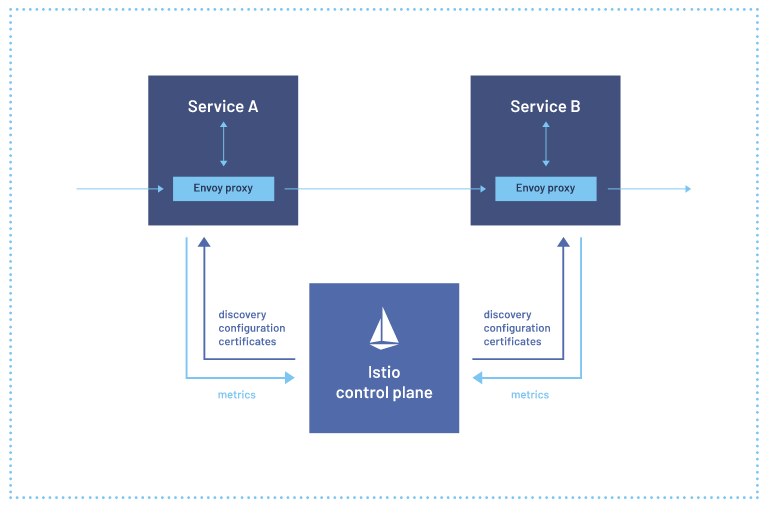
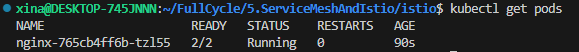

# Service Mesh

Camada extra adicionada em seu cluster para monitorar e modificar em tempo real o tráfego das aplicações, bem como elevar o nível de segurança e confiabilidade de todo ecosistema.

## Istio

Projeto open source que implementa service mesh visando diminuir a complexidade no gerenciamento de aplicações distribuídas independente de qual linguagem ou tecnologia as elas foram desenvolvidas.
Istio não é uma plataforma exclusiva para o k8s.

## Porque preciso de uma Service Mesh? Istio?

Gerenciamento de tráfego
    - Gateways (entrada e saída)
    - Load Balancing
    - Timout
    - Políticas de retry
    - Fault injection (Criar erros na aplicação de forma poposital, ajuda na observabilidade)
Observabilidade
    - Métricas
    - Traces distribuídos (Ver qual serviço chamou qual)
    - Logs
Segurança
    - Man-in-the-middle (Chamadas criptografadas)
    - mTLS
    - AAA (Authentication, authoriation, audit)

## Arquitetura do Isto

### Dinâmica && Sidecar Proxy


## Cluster com k3d

Abrir a porta 8000 a máquina host para a porta 30000 do container
```
k3d cluster create -p "8000:30000@loadbalancer" --agents 2
 ```

Mudando para o novo contexto
```
kubectl config use-context k3d-k3s-default
```


Lista os nodes para ver se funcionou
```
kubectl get nodes
```


Instalando o Istio

```
curl -L https://istio.io/downloadIstio | sh -
```

Move os arquivos para /opt
```
mv istio-1.18.0/ /opt
```

Coloca o bin do istio dentro do basrh para reconhecer o comando istioctl
```
echo 'export PATH="$PATH:/opt/istio-1.18.0/bin"' >> ~/.bashrc
```

Carrege o arquivo com ~/.bashrc com as alterações
```
source ~/.bashrc
```

Instale os módulos dentro do kubernetes
```
istioctl install
-> y
```

Verifique os pods criados
```
kubectl get pods -n istio-system
```


### Adicionando sidecar proxy

```
cd istio
kubectl apply -f ./deployment.yaml
```

Aplicando o sidecar proxy para todo o namespace default
```
kubectl label namespace default istio-injection=enabled
```

Vemos que não houve mudança já que o container foi criado antes da regra
```
kubectl get pods
```

Para ver a aplicação
```
kubectl delete deploy nginx
kubectl apply -f ./deployment.yaml
kubectl get pod
```



Instalando a parte de verificação e monitoramento (com gráficos)
Se der erro, é porque o prometheus ainda não terminou de rodar, basta rodar novamente
```
kubectl apply -f https://raw.githubusercontent.com/istio/istio/master/samples/addons/prometheus.yaml
kubectl apply -f https://raw.githubusercontent.com/istio/istio/master/samples/addons/kiali.yaml
kubectl apply -f https://raw.githubusercontent.com/istio/istio/master/samples/addons/jaeger.yaml
kubectl apply -f https://raw.githubusercontent.com/istio/istio/master/samples/addons/grafana.yaml
```

```
kubectl get pod -n istio-system
```

Aparecerá todos aqui nesse ns
```
NAME                                    READY   STATUS    RESTARTS   AGE
istiod-786fddf775-kjd5w                 1/1     Running   0          20m
istio-ingressgateway-644bdd7769-2hj2k   1/1     Running   0          20m
prometheus-67f6764db9-9jnqg             2/2     Running   0          3m6s
kiali-75b4b9df64-htngm                  1/1     Running   0          2m48s
jaeger-78756f7d48-ktnq8                 1/1     Running   0          113s
grafana-6cb5b7fbb8-tv2t4                1/1     Running   0          93s
```

Par ver em funcionamento, basta rodar
```
istioctl dashboard kiali
```


testando com fortio
```
kubectl apply -f https://raw.githubusercontent.com/istio/istio/release-1.18/samples/httpbin/sample-client/fortio-deploy.yaml
```

```
export FORTIO_POD=$(kubectl get pods -l app=fortio -o 'jsonpath={.items[0].metadata.name}')
```

```
kubectl exec "$FORTIO_POD" -c fortio -- fortio load -c 2 -qps 0 -t 200s -loglevel Warning http://nginx-service:8000
```

### Destination Rule e Virtual Service
O Destination Rule não depende do Virtual Service
O Virtual Service define roteamento, caso não houver, vai seguir o do nginx


### Strict Session(Consistent Hash)

Como manter a versão que o cliente vai conectar, para sempre conectar na mesma versão.
No Istio isto é chamado de consistent hash

```
kubectl apply -f ./consistent_hash.yaml
```

Dentro do pod, execute um curl com o header x-user e o cliente não irá mais para outro servidor
```
kubectl get pods
kubectl exec -it pod_name /bin/bash
curl --header "x-user: petrovick" http://nginx-service:8000
```


### Fault injection

Simular falha/atraso/delay do serviço
```
kubectl apply -f ./fault_injection.yaml
```

### Circuit breaker

```
cd ./circuit_breaker/k8s
kubectl apply -f ./deployment.yaml
```

Aqui vai mostrar as vezes que o serviço dá 504
```
kubectl exec "$FORTIO_POD" -c fortio  -- fortio load -c 2 -qps 0 -n 20 -loglevel Warning http://servicex-service:80
```

Aplicando Circuit breaker
```
kubectl apply -f ./circuit-breaker.yaml
```

Testando, execute duas vezes para ver a diferença de números de 504
```
kubectl exec "$FORTIO_POD" -c fortio  -- fortio load -c 2 -qps 0 -n 200 -loglevel Warning http://servicex-service:80
```


## Gateways

Quando um pod tem dois containers, basta passar a opção -c com o nome do container
```
kubectl exec -it nginx-b8fd78694-9cm4k -c nginx -- bash
```

Para editar a porta do istio-ingressgateway, como é local e não tem o IP externo então tem que mudar a porta, no caso de um EKS da vida não precisa alterar

```
kubectl edit svc istio-ingressgateway -n istio-system
```

Aplica o Gateway do istio

```
kubectl apply -f ./gateway.yaml
```

## Prefixos

Lembre-se de alterar o arquivo hosts para conseguir acessar via URl o domínio http://a.fullcycle:8000

Aplicando prefixos
```
kubectl apply -f ./gateway-domains.yaml
```
